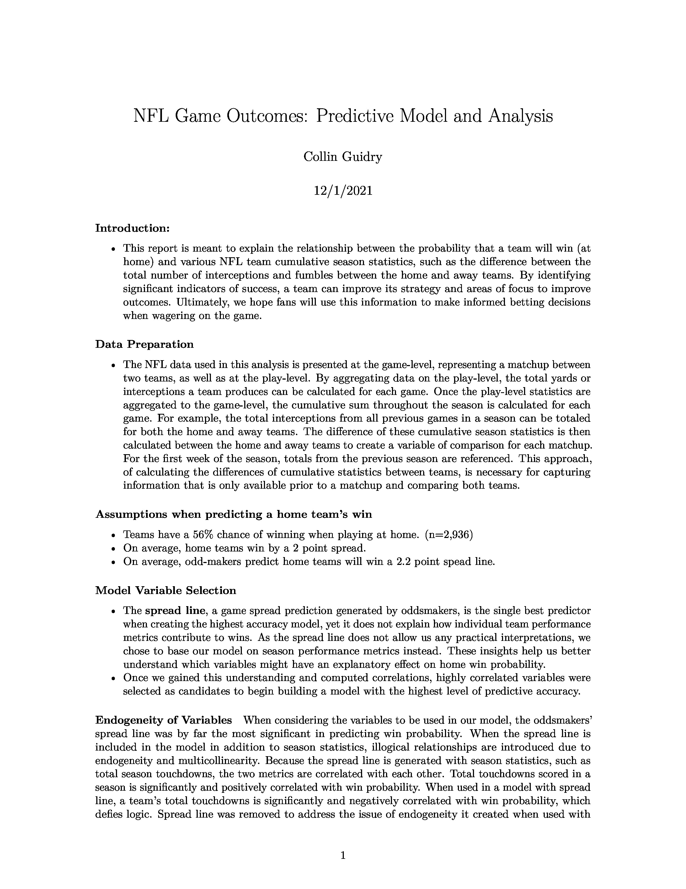
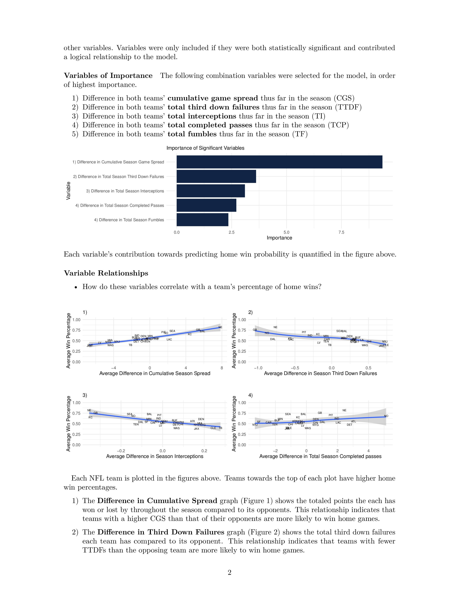
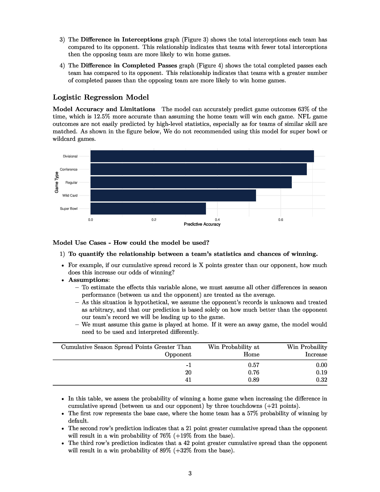
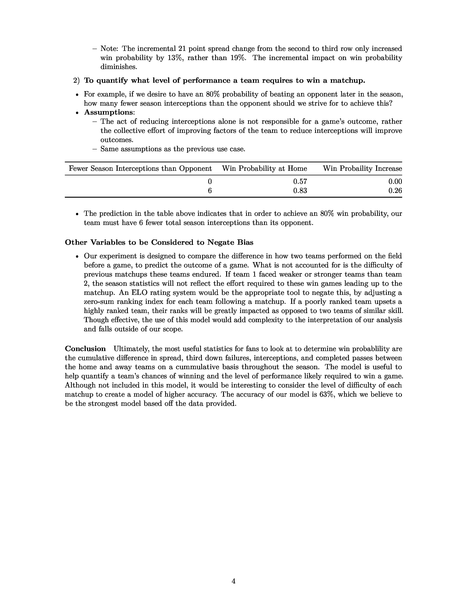

  

# NFL Game Win Prediction using Logistic Regression in R

## Introduction
This project aims to predict the outcomes of NFL games using logistic regression implemented in R. Dive deep into the methodology, variables considered, and insights gained by checking out the comprehensive [write-up](NFL-game-win-classifier.pdf):

 

## Features
- Logistic regression model for game outcome prediction
- Extensive creation of features, using cumulative season statistics
    - For first game of each season, stats from last season are used
- Comprehensive analysis and report on how variables impact win probability
- Combination of logic and documentation, enabled by .RMD format

## Requirements
- R (latest version recommended)
- Pandoc (for rendering PDFs)

## Installation

### R
Follow the instructions on the [official R website](https://www.r-project.org/) to install R.

### Pandoc
#### MacOS/Linux
1. Install Homebrew: `brew update`
2. Install Pandoc: `brew install pandoc`

## Getting Started
1. Clone this repository.
2. Open the project in an IDE that supports R (e.g., VSCode).
3. Install necessary R packages.
4. 'Knit to PDF' using the R extension with the shortcut CMD+SHIFT+K.
